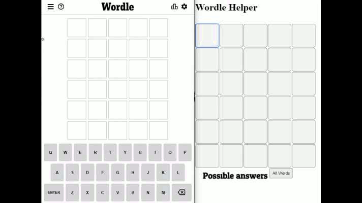

# Wordle Helper
A simple application to help with wordle-like games. Takes results from a 
series of guesses and returns all the possible words that fit the criteria.

Currently working on integrating this app into my personal website: www.josephcordara.com
You can run the cli.exe executable to use the program in the command line

For command line interface:
    type the letters of the guessed word
    insert ! character after letters that are correct (green)
    insert ? character after letters that are present (yellow)

    Example: fud?ge! [Enter]

Web interface demo (in development):

